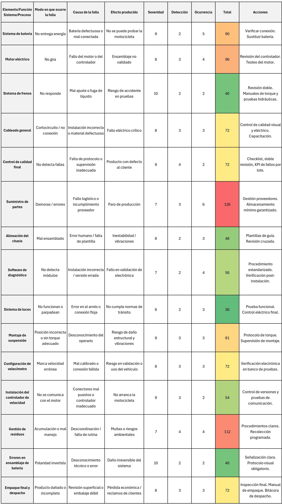

# Módulo 3: Planeación de Proyecto

## Definición de Objetivos, Alcance y Restricciones

El objetivo principal es desarrollar una línea de motos eléctricas innovadoras, enfocadas en el mercado urbano colombiano, priorizando la sostenibilidad, eficiencia energética y diseño atractivo. El alcance incluye el diseño técnico, la selección de componentes y la planificación de producción. Las restricciones son el presupuesto limitado, el tiempo de desarrollo (6 meses) y la disponibilidad local de materiales.

## Estructura Desglosada del Trabajo (EDT)

  

## Cronograma

<table>
  <thead>
    <tr>
      <th>Actividad</th>
      <th>Inicio</th>
      <th>Fin</th>
      <th>Responsable</th>
    </tr>
  </thead>
  <tbody>
    <tr><td>Definición de objetivos, alcance y restricciones del proyecto</td><td>04/02/2025</td><td>04/08/2025</td><td>Equipo completo</td></tr>
    <tr><td>Elaboración de la Estructura Desglosada del Trabajo (EDT) específica para motos eléctricas.</td><td>04/02/2025</td><td>04/08/2025</td><td>Equipo completo</td></tr>
    <tr><td>Creación del cronograma de actividades con herramientas como Gantt y asignación de responsables.</td><td>04/02/2025</td><td>04/08/2025</td><td>Equipo completo</td></tr>
    <tr><td>Análisis de necesidades del usuario y benchmarking de modelos existentes.</td><td>04/09/2025</td><td>04/15/2025</td><td>Natalia Cely</td></tr>
    <tr><td>Selección y justificación de características clave (tipo de motor, tipo de batería, chasis, frenos, etc.).</td><td>04/09/2025</td><td>04/25/2025</td><td>Felipe Chaves</td></tr>
    <tr><td>Obtención diseños CAD de ejemplo de las motos eléctricas</td><td>06/04/2025</td><td>07/04/2025</td><td>Andres Torres</td></tr>
    <tr><td>Creación lista de materiales, tabla BOM</td><td>05/02/2025</td><td>05/07/2025</td><td>Equipo completo</td></tr>
    <tr><td>Creación página WEB (Página inicial)</td><td>05/02/2025</td><td>05/06/2025</td><td>Equipo completo</td></tr>
    <tr><td>Diseño del layout de la planta de ensamblaje (antes de la automatización).</td><td>05/07/2025</td><td>05/21/2025</td><td>Natalia Cely</td></tr>
    <tr><td>Propuesta de automatización de procesos de ensamblaje (robots, sistemas de transporte, estaciones de prueba).</td><td>05/07/2025</td><td>05/28/2025</td><td>Felipe Chaves</td></tr>
    <tr><td>Simulación del flujo de trabajo con herramientas como Tecnomatix o simuladores de procesos industriales.</td><td>05/22/2025</td><td>06/06/2025</td><td>Marco Quimbay</td></tr>
    <tr><td>Definición de indicadores clave (OEE, tiempo de ciclo, defectos por unidad, etc.).</td><td>06/23/2025</td><td>06/27/2025</td><td>Equipo completo</td></tr>
    <tr><td>Cálculo de costos de producción: materiales, mano de obra, energía, mantenimiento, etc.</td><td>05/29/2025</td><td>06/02/2025</td><td>Natalia Cely</td></tr>
    <tr><td>Estimación de inversión inicial (maquinaria, herramientas, instalación).</td><td>05/29/2025</td><td>06/05/2025</td><td>Felipe Chaves</td></tr>
    <tr><td>Análisis financiero: VPN, TIR, Payback, punto de equilibrio.</td><td>05/29/2025</td><td>06/06/2025</td><td>Marco Quimbay</td></tr>
    <tr><td>Elaboración de curva S del proyecto para control de avance presupuestal.</td><td>06/09/2025</td><td>06/13/2025</td><td>Equipo completo</td></tr>
    <tr><td>Selección de proveedores para componentes clave (baterías, motores, controladores).</td><td>06/13/2025</td><td>06/20/2025</td><td>Equipo completo</td></tr>
    <tr><td>Implementación del gemelo digital, desarrollo y validación de HMI</td><td>06/30/2025</td><td>07/11/2025</td><td>Equipo completo</td></tr>
    <tr><td>Verificación de cumplimiento de requisitos técnicos y financieros.</td><td>07/07/2025</td><td>07/18/2025</td><td>Equipo completo</td></tr>
    <tr><td>Correcciones y finalización página web</td><td>07/07/2025</td><td>07/18/2025</td><td>Equipo completo</td></tr>
    <tr><td>Documentación de resultados y reportes.</td><td>07/07/2025</td><td>07/18/2025</td><td>Equipo completo</td></tr>
    <tr><td>Preparación presentación final y video</td><td>07/07/2025</td><td>07/14/2025</td><td>Equipo completo</td></tr>
    <tr><td>Documentación y entrega final, avances página web</td><td>04/21/2025</td><td>07/11/2025</td><td>Equipo completo</td></tr>
  </tbody>
</table>

## Visualización del Cronograma (Gantt)

  

## Análisis de Necesidades del Usuario y Benchmarking

Se realizó una investigación en el mercado colombiano de movilidad urbana, encontrando que los usuarios priorizan la autonomía, el diseño deportivo, la conectividad y facilidad de recarga. El benchmarking incluyó marcas como NIU, Super Soco y Stärker, destacando elementos clave como baterías intercambiables, conectividad vía app y diseño aerodinámico.

  <table border="1" cellspacing="0" cellpadding="10" style="width: 100%; border-collapse: collapse;">
    <tbody>
      <tr>
        <td><strong>Socios clave</strong></td>
        <td>Proveedores de componentes eléctricos y mecánicos, aliados de distribución, talleres de ensamblaje, instituciones que promuevan movilidad eléctrica.</td>
      </tr>
      <tr>
        <td><strong>Actividades clave</strong></td>
        <td>Diseño y ensamblaje de motos eléctricas, marketing digital, pruebas técnicas, desarrollo web, atención al cliente, alianzas logísticas.</td>
      </tr>
      <tr>
        <td><strong>Recursos clave</strong></td>
        <td>Prototipos, taller, herramientas, equipo humano interdisciplinario, página web, marca y conocimientos técnicos.</td>
      </tr>
      <tr>
        <td><strong>Propuesta de valor</strong></td>
        <td>
          Motos eléctricas urbanas con diseño atractivo, tecnología avanzada y rendimiento competitivo, enfocadas al usuario latinoamericano. 
          Personalización de corte para porta-placas de acuerdo con la línea de la moto.
        </td>
      </tr>
      <tr>
        <td><strong>Relación con clientes</strong></td>
        <td>Web interactiva, atención personalizada, comunidad de usuarios, soporte técnico postventa.</td>
      </tr>
      <tr>
        <td><strong>Canales</strong></td>
        <td>Web oficial, ferias tecnológicas, distribuidores locales, redes sociales.</td>
      </tr>
      <tr>
        <td><strong>Segmentos de mercado</strong></td>
        <td>Jóvenes urbanos, profesionales que usan motos, estudiantes, tech-savvy, usuarios de movilidad sostenible.</td>
      </tr>
      <tr>
        <td><strong>Estructura de costos</strong></td>
        <td>Prototipado, componentes, licencias de software, hosting web, materiales, publicidad, equipo humano.</td>
      </tr>
      <tr>
        <td><strong>Fuentes de ingresos</strong></td>
        <td>Venta de motos, personalización, repuestos, mantenimiento técnico.</td>
      </tr>
    </tbody>
  </table>

## Análisis de riesgos 

Para analizar los riesgos del proyecto se utilizó una matriz AMFE (Análisis Modal de Fallos y Efectos), una herramienta utilizada para identificar, evaluar y priorizar los posibles fallos que pueden ocurrir en un sistema, analizando su impacto, las probabilidades de ocurrencia y la capacidad de detección. Esta matriz es útil para diseñar estrategias preventivas y correctivas que aseguren el correcto funcionamiento de la planta, minimizando riesgos y garantizando su confiabilidad.

  

  
  <table border="1" cellspacing="0" cellpadding="4">
    <thead>
      <tr>
        <th>Elemento/Función Sistema/Proceso</th>
        <th>Modo en que ocurre la falla</th>
        <th>Causa de la falla</th>
        <th>Efecto producido</th>
        <th>Severidad</th>
        <th>Detección</th>
        <th>Ocurrencia</th>
        <th>Total</th>
        <th>Acciones</th>
      </tr>
    </thead>
    <tbody>
      <tr>
        <td>Sistema de batería</td>
        <td>No entrega energía</td>
        <td>Batería defectuosa o mal conectada</td>
        <td>No se puede probar la motocicleta</td>
        <td>9</td><td>2</td><td>5</td>
        <td style="background-color:#ffcc00;">90</td>
        <td>Verificar conexión. Sustituir batería.</td>
      </tr>
      <tr>
        <td>Motor eléctrico</td>
        <td>No gira</td>
        <td>Fallo del motor o del controlador</td>
        <td>Ensamblaje no validado</td>
        <td>8</td><td>3</td><td>4</td>
        <td style="background-color:#ff9900;">96</td>
        <td>Revisión del controlador. Testeo del motor.</td>
      </tr>
      <tr>
        <td>Sistema de frenos</td>
        <td>No responde</td>
        <td>Mal ajuste o fuga de líquido</td>
        <td>Riesgo de accidente en pruebas</td>
        <td>10</td><td>2</td><td>2</td>
        <td style="background-color:#66cc66;">40</td>
        <td>Revisión doble. Manuales de torque y pruebas hidráulicas.</td>
      </tr>
      <tr>
        <td>Cableado general</td>
        <td>Cortocircuito / no conexión</td>
        <td>Instalación incorrecta o material defectuoso</td>
        <td>Fallo eléctrico crítico</td>
        <td>8</td><td>3</td><td>3</td>
        <td style="background-color:#ffcc00;">72</td>
        <td>Control de calidad visual y eléctrico. Capacitación.</td>
      </tr>
      <tr>
        <td>Control de calidad final</td>
        <td>No detecta fallas</td>
        <td>Falta de protocolo o supervisión inadecuada</td>
        <td>Producto con defecto al cliente</td>
        <td>9</td><td>4</td><td>2</td>
        <td style="background-color:#ffcc00;">72</td>
        <td>Checklist, doble revisión, KPI de fallos por lote.</td>
      </tr>
      <tr>
        <td>Suministro de partes</td>
        <td>Demoras / errores</td>
        <td>Fallo logístico o incumplimiento proveedor</td>
        <td>Paro de producción</td>
        <td>7</td><td>3</td><td>6</td>
        <td style="background-color:#ff3300;">126</td>
        <td>Gestión proveedores. Almacenamiento mínimo garantizado.</td>
      </tr>
      <tr>
        <td>Alineación del chasis</td>
        <td>Mal ensamblado</td>
        <td>Error humano / falta de plantilla</td>
        <td>Inestabilidad / vibraciones</td>
        <td>8</td><td>2</td><td>3</td>
        <td style="background-color:#99cc66;">48</td>
        <td>Plantillas de guía. Revisión cruzada.</td>
      </tr>
      <tr>
        <td>Software de diagnóstico</td>
        <td>No detecta módulos</td>
        <td>Instalación incorrecta / versión errada</td>
        <td>Fallo en validación de electrónica</td>
        <td>7</td><td>2</td><td>4</td>
        <td style="background-color:#cccc66;">56</td>
        <td>Procedimiento estandarizado. Verificación post-instalación.</td>
      </tr>
      <tr>
        <td>Sistema de luces</td>
        <td>No funcionan o parpadean</td>
        <td>Error en el arnés o conexión floja</td>
        <td>No cumple normas de tránsito</td>
        <td>6</td><td>2</td><td>3</td>
        <td style="background-color:#66cc66;">36</td>
        <td>Prueba funcional. Control eléctrico final.</td>
      </tr>
      <tr>
        <td>Montaje de suspensión</td>
        <td>Posición incorrecta o sin torque adecuado</td>
        <td>Desconocimiento del operario</td>
        <td>Riesgo de daño estructural y vibraciones</td>
        <td>9</td><td>3</td><td>3</td>
        <td style="background-color:#ffcc66;">81</td>
        <td>Protocolo de torque. Supervisión de montaje.</td>
      </tr>
      <tr>
        <td>Configuración de velocímetro</td>
        <td>Marca velocidad errónea</td>
        <td>Mal calibrado o conexión fallida</td>
        <td>Riesgo en validación o uso del vehículo</td>
        <td>8</td><td>3</td><td>3</td>
        <td style="background-color:#ffcc00;">72</td>
        <td>Verificación electrónica en banco de pruebas.</td>
      </tr>
      <tr>
        <td>Instalación del controlador de velocidad</td>
        <td>No se comunica con el motor</td>
        <td>Conectores mal puestos o controlador inadecuado</td>
        <td>No arranca la motocicleta</td>
        <td>9</td><td>3</td><td>2</td>
        <td style="background-color:#99cc66;">54</td>
        <td>Control de versiones y pruebas de comunicación.</td>
      </tr>
      <tr>
        <td>Gestión de residuos</td>
        <td>Acumulación o mal manejo</td>
        <td>Descoordinación / falta de rutina</td>
        <td>Multas o riesgos ambientales</td>
        <td>7</td><td>4</td><td>4</td>
        <td style="background-color:#ff3300;">112</td>
        <td>Procedimientos claros. Recolección programada.</td>
      </tr>
      <tr>
        <td>Errores en ensamblaje de batería</td>
        <td>Polaridad invertida</td>
        <td>Desconocimiento técnico o error</td>
        <td>Daño irreversible del sistema</td>
        <td>10</td><td>2</td><td>2</td>
        <td style="background-color:#66cc66;">40</td>
        <td>Señalización clara. Protocolo visual obligatorio.</td>
      </tr>
      <tr>
        <td>Empaque final y despacho</td>
        <td>Producto dañado o incompleto</td>
        <td>Revisión superficial o embalaje débil</td>
        <td>Pérdida económica / reclamos de clientes</td>
        <td>8</td><td>3</td><td>3</td>
        <td style="background-color:#ffcc00;">72</td>
        <td>Inspección final. Manual de empaque. Bitácora de despacho.</td>
      </tr>
    </tbody>
  </table>

## Curva de S de avance 

A continuación se puede observar la curva S del avance del proyecto, donde es notable que en las semanas tempranas del proyecto el avance fué más lento de lo esperado y que a partir de la semana 10 se presenta un incremento significativo en la tasa de avance, que permitió llegar al resultado obtenido en los tiempos estimados.

  

